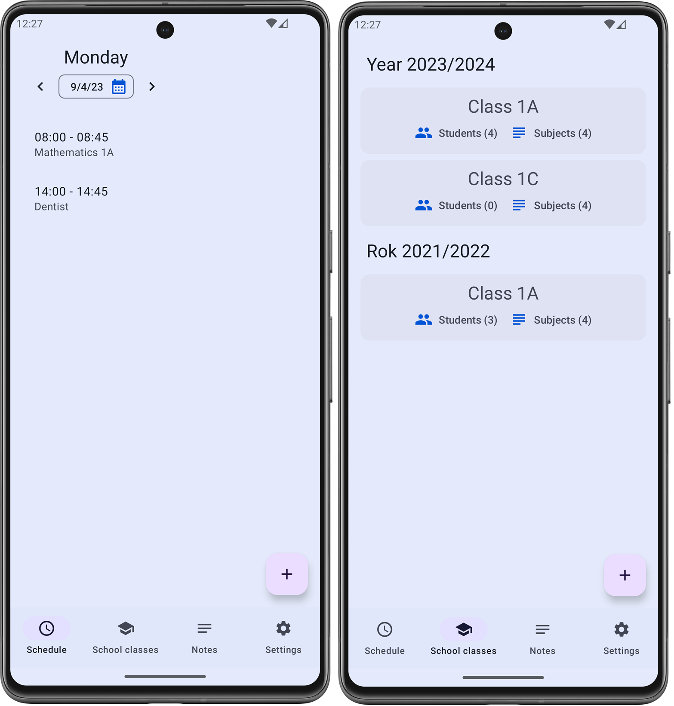
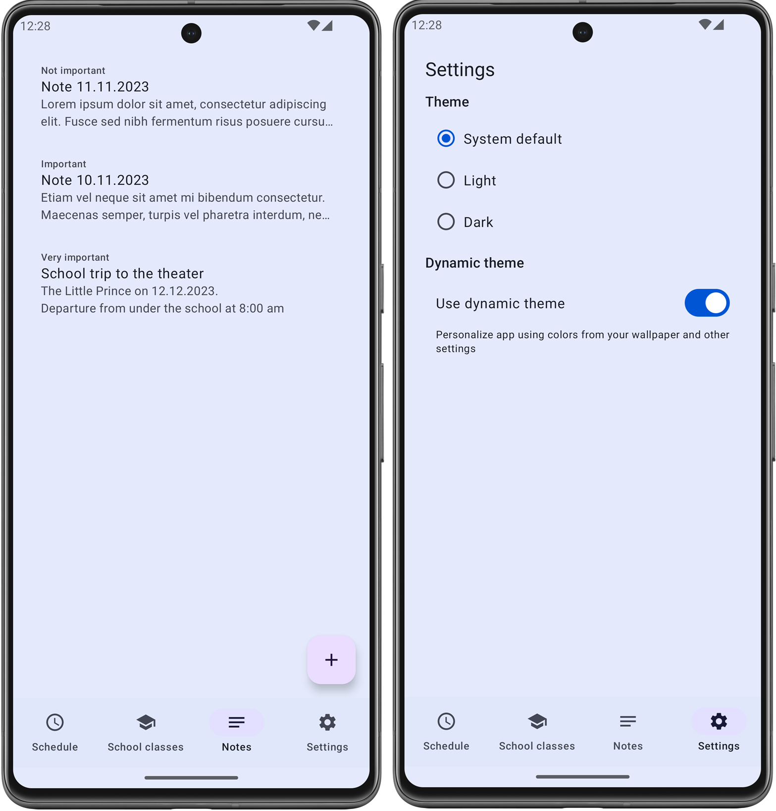
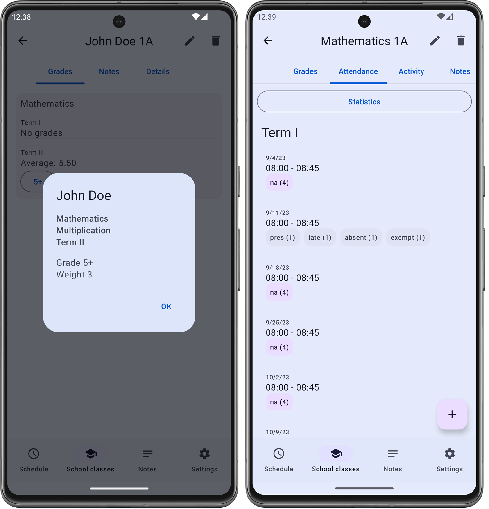

# Teacher mobile application notebook/diary (offline)

Highlights:

- schedule (events and class dates)
- students and subjects grouped in class
- notes: personal and also for students and subjects
- attendance
- grades
- security (required PIN, password, fingerprint or other)
- dynamic theme

- Deps:
    - Jetpack Compose
    - Material3
    - Hilt
    - Datastore
    - SQLDelight
    - Biometric

- multi module app

# Main screens:

Main screens (schedule, school classes)

Main screens (notes, settings)

Student grades and subject attendance screens

